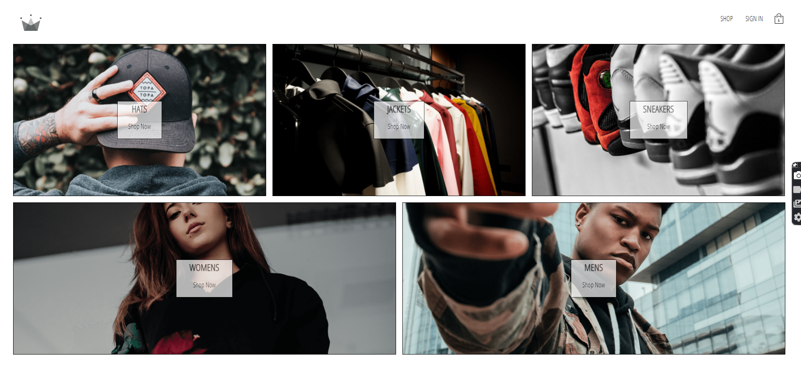
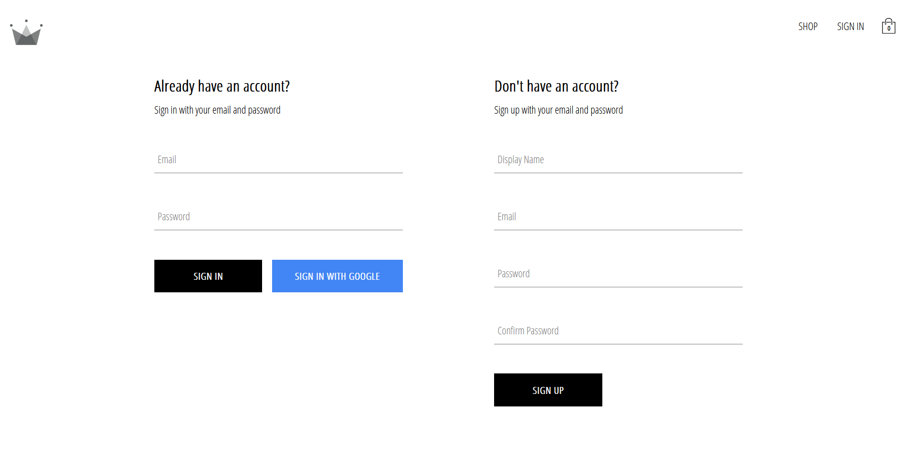
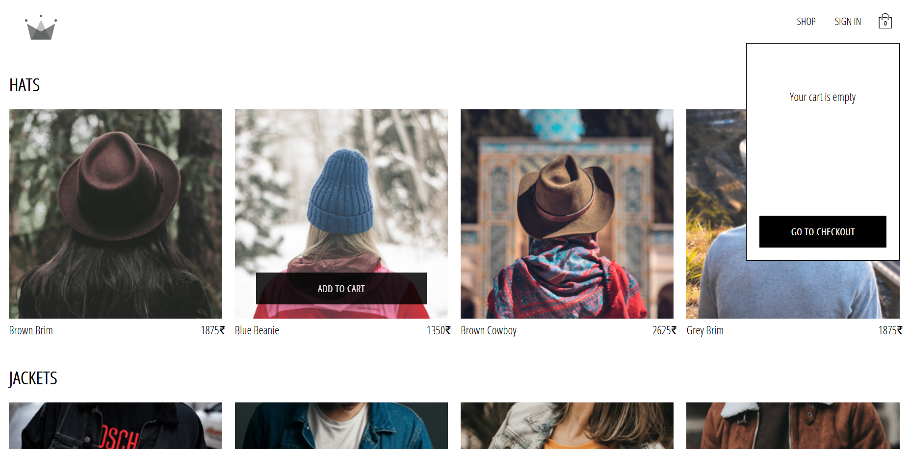
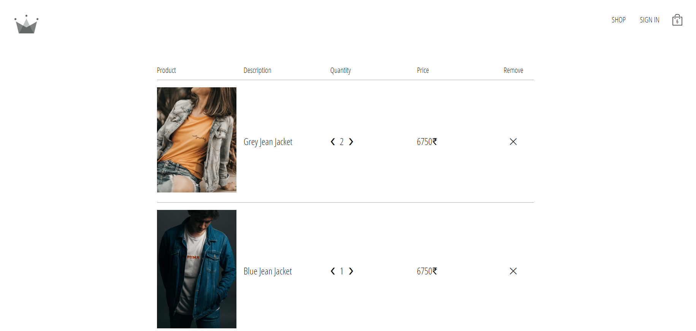

# React-CrownClothing

Link to the live web application => (https://db-crownclothing.web.app) \
A Frontend, React/Firebase "E-Commerce" Web-application.\
This project utilises Firebase backend with its authentication services along with a Reactjs front-end.

Some of the features:

1. Application contains a responsive, reactive cart for the products.
2. Uses Stripe API as a method for payments.
3. Provides a sign-in/sign-up with email or google as login methods.
4. Uses cloud based backend provided by Firebase.
5. All of the styling has been done with styled-components, a Reatjs library.

This is the project with which I learned React up from the very basics. Faced a lot of challenges and enjoyed the incredible experience.

## Here's how it looks-like

## Here are some of the Clips

https://user-images.githubusercontent.com/78212328/175823959-918dd47f-a284-491e-97f6-54a5e4980423.mp4

## How to Run the project on your Device

First step is install latest version of Nodejs on your device.\
Clone/fork the repository or download zipped code files.\
In the project directory, you can run:

### `npm install`

Runs the node pakage manager (npm) and installs the dependencies of the project.

### `npm audit fix` (optional but recommended)

Runs the node pakage manager (npm) and fixes any issue with modules.

### `npm start`

Runs the app in the development mode.\
Open [http://localhost:3000](http://localhost:3000) to view it in your browser.\

The page will reload when you make changes.
